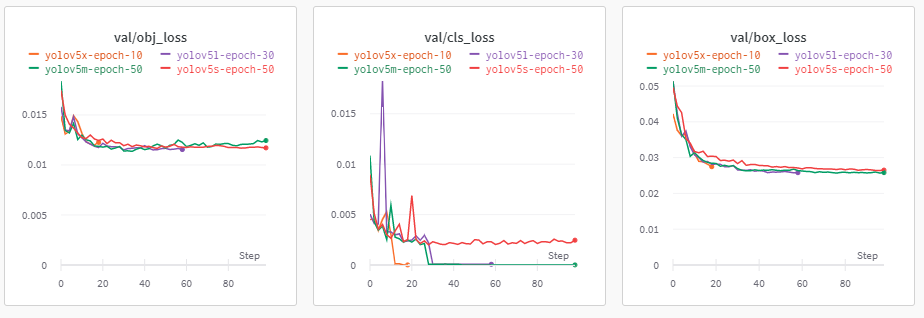

<h1 align="center"> 😷 Face mask detection 😷 </h1>
<h3 align="center"><b>Experiment face mask detection with YOLOv5 models on WandB<b>  <a href="https://wandb.ai/lannguyen/face-mask-yolov5"></a></h3>

<br>

## 🌟 **Inference on Google Colab (Recommend)**
- **Open notebook and follow the instructions** [](https://colab.research.google.com/drive/1KTAk_kdO74OvXMGxdGdOLx6QPu3Yr0rb?usp=sharing)

## 🌟 **Inference on local machine (Require CUDA)**
- Clone the repo
```
git clone https://github.com/lannguyen0910/face-mask-yolov5/
cd face-mask-yolov5/deployment/
```
- Install dependencies
```
pip install -r requirements.txt
```
- Download yolov5 weights (About 1.3Gb)
```
python download_weights.py
```
- Start the app. Options: [yolov5s.pt | yolov5m.pt | yolov5l.pt | yolov5x.pt]
```
python app.py --host localhost:3000 --weights './models/weights/yolov5s.pt'
```

🚨 There is a high chance that you'll face some errors when run the app on local machine. Feel free to make a pull request!  

## 🌟 **Train YOLOv5 models** 
- **Open notebook and follow the instructions** [](https://colab.research.google.com/drive/1ZUZHRlUe6wgXHjdjbHf7-npJAhSPJUwn?usp=sharing)

## 🌟 **Results**
<p align="center">
    
    
</p>

## 🌟 **Experiments**
**Full experiment details on** <a href="https://wandb.ai/lannguyen/face-mask-yolov5"></a>
    
<br>

**I personally train [yolov5s, yolov5m] models for 50 epochs, [yolov5l] model for 30 epochs [yolov5x] model for 10 epochs due to high computational expenses.**
    
### **Metrics**
<p align="center">
    
    
    
</p>

### **Losses**

<p align="center">
    
    
</p>

# 📙 **References**
- Inspire from: https://github.com/waittim/mask-detector
